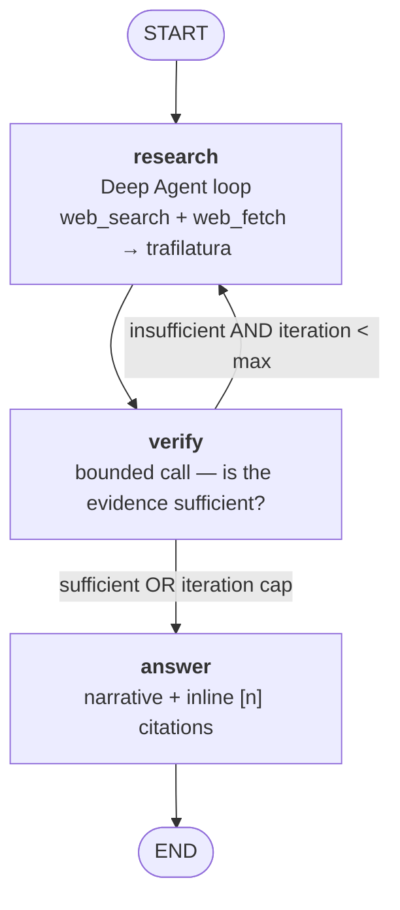

<h1 align="center">WebScout</h1>

<p align="center">
  <em>A mini deep-research agent — asks, searches, reads, verifies, then answers with citations.</em>
</p>

<p align="center">
  <a href="https://github.com/thanhhieu16/web_scout/actions/workflows/test.yml"></a>
  
  <a href="https://docs.astral.sh/uv/"></a>
  <a href="LICENSE"></a>
</p>

---

WebScout takes a question, searches the web, reads the pages it finds, judges whether the evidence is
sufficient, and — only then — writes an answer with real citations. **Deep Agents** acts as the research
harness inside a **LangGraph** control plane; every model call is served through **OpenRouter**, with
tracing and evals on **LangSmith**.

- **Two nested loops** — Deep Agents drives the inner tool loop, LangGraph drives the outer research → verify → answer loop.
- **A verifier that can say "not yet"** — insufficient evidence sends the graph back for another research pass, up to `max_iterations`.
- **Citations reconstructed, not trusted** — every `[n]` in the answer is reconciled against URLs the agent actually retrieved.
- **Real reading, not just snippets** — `web_fetch` streams pages under a byte cap and extracts article text with trafilatura.
- **Guarded fetching** — `web_fetch` refuses non-HTTP schemes and any host resolving to a private, loopback, or link-local address, re-checking on every redirect hop.
- **Budget visible on every run** — iterations, searches, sources, tokens and estimated cost printed as a METRICS line.
- **Offline-testable** — the pipeline has injection seams throughout, so the default suite runs with no network and no API key.

## How it works



Only three nodes exist. `verify` and `answer` are single bounded structured calls — no tools, no internal
loops — which keeps the cost of a run proportional to the research it actually needed.

### Evidence flow

1. The research agent replies in prose and ends every turn with a `## FINDINGS` block:
   `- [S1] claim | confidence: high`.
2. The source list is **rebuilt from the message history**, never taken from the model: URL citation
   annotations first, then `[SRC]` blocks parsed out of `web_search` results, then successfully fetched
   pages. That order defines the `[Sn]` numbering.
3. Each `Sn` ref is resolved to a real URL. Anything unresolvable is reported as a **weak claim** rather
   than silently dropped.

## Requirements

| | |
|---|---|
| Python | >= 3.12 |
| Package manager | [uv](https://docs.astral.sh/uv/) |
| Required key | [OpenRouter](https://openrouter.ai/) API key |
| Optional key | LangSmith API key (tracing + evals) |

## Quick start

```powershell
uv sync                             # install, including dev group (pytest, ruff)

Copy-Item .env.example .env         # then fill in OPENROUTER_API_KEY

uv run webscout "What changed in the EU AI Act in 2026?"
```

`.env` is loaded automatically at startup — no manual `$env:` exports needed. Existing OS environment
variables still take precedence over `.env`.

```dotenv
OPENROUTER_API_KEY=sk-or-...   # required
LANGSMITH_TRACING=true         # optional
LANGSMITH_API_KEY=lsv2_...     # optional, enables LangSmith tracing
LANGSMITH_PROJECT=webscout     # optional
```

Settings precedence: **init kwargs > environment variables > `.env` > `config.yaml`**.

## Usage

**One-shot**:

```powershell
uv run webscout "What changed in the EU AI Act in 2026?"
```

**Interactive** — omit the question; leave with `exit`, `quit`, Ctrl+C or Ctrl+D:

```powershell
uv run webscout
webscout> your question here
```

**Markdown report** — same run, plus a file containing the answer, findings and sources:

```powershell
uv run webscout "What changed in the EU AI Act in 2026?" --out report.md
```

### What a run looks like

```text
[research] ...
[verify] ...
[research] ...
[verify] ...
[answer] ...

=== ANSWER ===

The EU AI Act ... general-purpose model obligations applied from 2 August 2025 [1], while ...

=== SOURCES ===
[1] Regulation (EU) 2024/1689 — https://eur-lex.europa.eu/eli/reg/2024/1689/oj
[2] AI Act implementation timeline — https://artificialintelligenceact.eu/implementation-timeline/

=== METRICS ===
iterations: 2 | searches: 3 | sources: 2 | tokens: 41892 | est_cost: $0.0631
```

The answer follows the language of the question.

## Testing

```powershell
uv run pytest -m "not integration"    # offline suite — no network, no key (this is what CI runs)
uv run pytest -m integration          # hits OpenRouter and the live web
uv run pytest tests/test_node_verify.py::test_verify_returns_own_weak_claims_only   # a single test
```

Integration tests need a key in the environment:

```powershell
$env:OPENROUTER_API_KEY = "sk-or-..."
uv run pytest -m integration
```

The offline suite stays network-free through explicit seams: node factories accept a fake `model=`,
`make_web_fetch` / `make_web_search` accept an `httpx.MockTransport`, and `build_graph` resolves the
research agent as a module attribute so it can be monkeypatched.

## Evals

Evals run through LangSmith (`LANGSMITH_API_KEY` required). They upload `evals/dataset.json` (24 examples),
execute the full graph per example, and score **correctness**, **citation support**, and metrics
(sources count, search calls, latency, tokens).

```powershell
uv run python -m evals.run_evals                       # full dataset
uv run python -m evals.run_evals --limit 2             # first N examples
uv run python -m evals.run_evals --experiment-prefix demo
uv run python -m evals.summarize                       # A/B table across arms
```

Results appear as an experiment in your LangSmith project. `evals.summarize` aggregates the
skill-on/off × iteration-cap arms into one table; the recorded run lives in
[`evals/runs/skill-ab-v2.md`](evals/runs/skill-ab-v2.md).

## Configuration (`config.yaml`)

| Key | Default | Description |
|---|---|---|
| `researcher.model` | `stealth/ox-alpha` | Model for the research agent (via OpenRouter) |
| `researcher.temperature` | `0.2` | Sampling temperature for research |
| `verifier.model` | `stealth/ox-alpha` | Model for the sufficiency verdict |
| `verifier.temperature` | `0.0` | Verifier temperature (deterministic) |
| `answer.model` | `stealth/ox-alpha` | Model writing the final narrative |
| `answer.temperature` | `0.3` | Answer temperature |
| `max_iterations` | `3` | Max research → verify loops before forcing an answer |
| `skills_enabled` | `true` | Attach the `web-research` methodology skill to the agent |
| `search.max_results` | `5` | Results requested per `openrouter:web_search` call |
| `search.max_uses` | `4` | Cap on `web_search` calls per research turn |
| `search.max_characters` | `4000` | Max characters kept per search result snippet |
| `fetch.timeout_seconds` | `15.0` | HTTP timeout for `web_fetch` |
| `fetch.max_chars` | `20000` | Max characters extracted per fetched page |
| `fetch.user_agent` | `WebScout/0.1 (research agent)` | User-Agent header sent by `web_fetch` |
| `fetch.max_download_bytes` | `2000000` | Cap on bytes downloaded per fetch before extraction |
| `fetch.max_redirects` | `5` | Redirect hops followed, each re-checked against the address guard |
| `fetch.allow_private_hosts` | `false` | Set true only to fetch from localhost or a private network during development |

Swapping models is a one-line edit to the `researcher` / `verifier` / `answer` roles. Environment
variables override YAML where defined (`OPENROUTER_API_KEY`, also accepted as
`WEBSCOUT_OPENROUTER_API_KEY`); `openrouter_base_url` defaults to `https://openrouter.ai/api/v1`.

## Project layout

```text
app/
  main.py        CLI: run_pipeline (graph), run_question (agent only), markdown report
  graph.py       LangGraph product loop (research -> verify -> answer)
  state.py       ResearchState TypedDict (counters accumulated by hand)
  agent.py       Deep Agents research harness
  models.py      ResearchChatOpenAI — OpenRouter-backed chat model
  config.py      pydantic-settings (env + .env + config.yaml)
  schemas.py     Findings / verdict / answer contracts
  backoff.py     retry wrapper around every LLM call
  nodes/         parsing, research, verify, answer
  tools/         web_search adapter + client-side tool, web_fetch (httpx + trafilatura)
skills/
  web-research/  research methodology skill (toggled by skills_enabled)
evals/           dataset.json, evaluators, run_evals runner, summarize
tests/           offline suite (+ integration marker)
```

## Docs

- Design spec — [`docs/superpowers/specs/2026-08-25-webscout-design.md`](docs/superpowers/specs/2026-08-25-webscout-design.md)
- Implementation plan — [`docs/superpowers/plans/2026-08-25-webscout-v0-v3.md`](docs/superpowers/plans/2026-08-25-webscout-v0-v3.md)
- Spike findings & experiment notes — [`docs/superpowers/notes/`](docs/superpowers/notes/) *(written in Vietnamese; they record why the model layer looks the way it does)*
- Guidance for Claude Code in this repo — [`CLAUDE.md`](CLAUDE.md)

## Troubleshooting

| Symptom | Fix |
|---|---|
| `cp65001` / Unicode errors when printing the answer on Windows | Set `$env:PYTHONIOENCODING="utf-8"` before running |
| `OPENROUTER_API_KEY is not set...` on startup | Intentional early exit — copy `.env.example` to `.env` and fill it in, instead of failing mid-run with an OpenRouter 401 |

## License

[MIT](LICENSE)
