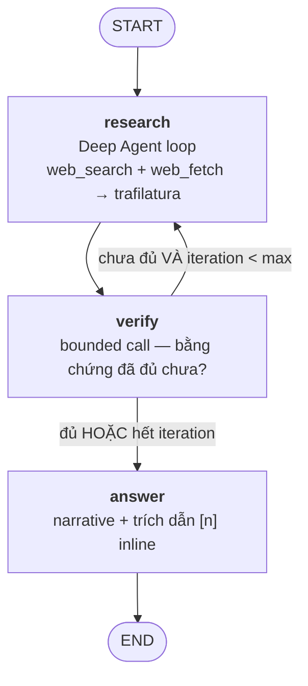

<h1 align="center">WebScout</h1>

<p align="center">
  <em>Một deep-research agent thu nhỏ — hỏi, tìm kiếm, đọc, kiểm chứng, rồi mới trả lời kèm trích dẫn.</em>
</p>

<p align="center">
  <a href="README.md">English</a> | Tiếng Việt
</p>

<p align="center">
  <a href="https://github.com/thanhhieu16/web_scout/actions/workflows/test.yml"></a>
  
  <a href="https://docs.astral.sh/uv/"></a>
  <a href="LICENSE"></a>
</p>

---

WebScout nhận một câu hỏi, tìm kiếm trên web, đọc các trang tìm được, đánh giá xem bằng chứng đã
đủ chưa — và chỉ khi đủ mới viết câu trả lời kèm trích dẫn thật. **Deep Agents** đóng vai trò research
harness bên trong control plane **LangGraph**; mọi lời gọi model đều qua **OpenRouter**, tracing và
eval chạy trên **LangSmith**.

- **Hai vòng lặp lồng nhau** — Deep Agents điều khiển vòng lặp tool bên trong, LangGraph điều khiển vòng lặp research → verify → answer bên ngoài.
- **Verifier có thể nói "chưa đủ"** — bằng chứng chưa đủ sẽ đẩy graph quay lại research thêm một vòng, tối đa `max_iterations`.
- **Trích dẫn được dựng lại, không tin mù** — mỗi `[n]` trong câu trả lời đều được đối chiếu với URL agent thực sự đã lấy về.
- **Đọc thật, không chỉ snippet** — `web_fetch` stream trang dưới một giới hạn byte và trích xuất nội dung bài viết bằng trafilatura.
- **Fetch có bảo vệ** — `web_fetch` từ chối scheme không phải HTTP và mọi host phân giải ra địa chỉ private, loopback, hay link-local, kiểm tra lại ở mỗi hop redirect.
- **Search có fallback** — chuyển sang scrape endpoint HTML không-JS của DuckDuckGo khi search qua OpenRouter lỗi hẳn, để một lần OpenRouter sập không làm nghẽn cả phiên research.
- **Cache các lượt tra trùng** — cache in-memory 30 phút bỏ qua các lượt search/fetch trùng lặp trong cùng phiên hoặc giữa các câu hỏi liên quan.
- **Ngân sách hiển thị mỗi lần chạy** — số vòng lặp, số lượt search, số nguồn, số token và chi phí ước tính in ra ở dòng METRICS.
- **Test được offline** — pipeline có sẵn các điểm inject xuyên suốt, nên bộ test mặc định chạy không cần mạng, không cần API key.

## Cách hoạt động



Chỉ có ba node. `verify` và `answer` là các lời gọi structured, bounded, gọi một lần — không tool,
không vòng lặp nội bộ — nhờ vậy chi phí một lần chạy tỉ lệ đúng với lượng research thực sự cần.

### Luồng bằng chứng

1. Research agent trả lời bằng văn xuôi và luôn kết thúc mỗi lượt bằng một block `## FINDINGS`:
   `- [S1] claim | confidence: high`.
2. Danh sách nguồn được **dựng lại từ lịch sử tin nhắn**, không bao giờ lấy trực tiếp từ model: ưu
   tiên annotation trích dẫn URL trước, rồi đến các block `[SRC]` parse ra từ kết quả `web_search`,
   rồi đến các trang `web_fetch` thành công. Thứ tự này quyết định cách đánh số `[Sn]`.
3. Mỗi tham chiếu `Sn` được resolve về một URL thật. Cái nào không resolve được sẽ báo là **weak
   claim** thay vì âm thầm bỏ qua.

## Yêu cầu

| | |
|---|---|
| Python | >= 3.12 |
| Trình quản lý gói | [uv](https://docs.astral.sh/uv/) |
| Key bắt buộc | API key [OpenRouter](https://openrouter.ai/) |
| Key tùy chọn | API key LangSmith (tracing + eval) |

## Bắt đầu nhanh

```powershell
uv sync                             # cài đặt, bao gồm dev group (pytest, ruff)

Copy-Item .env.example .env         # rồi điền OPENROUTER_API_KEY

uv run webscout "What changed in the EU AI Act in 2026?"
```

`.env` được tự động load lúc khởi động — không cần `$env:` thủ công. Biến môi trường OS có sẵn
vẫn được ưu tiên hơn `.env`.

```dotenv
OPENROUTER_API_KEY=sk-or-...   # bắt buộc
LANGSMITH_TRACING=true         # tùy chọn
LANGSMITH_API_KEY=lsv2_...     # tùy chọn, bật LangSmith tracing
LANGSMITH_PROJECT=webscout     # tùy chọn
```

Thứ tự ưu tiên settings: **init kwargs > biến môi trường > `.env` > `config.yaml`**.

## Sử dụng

**Chạy một lần**:

```powershell
uv run webscout "What changed in the EU AI Act in 2026?"
```

**Tương tác** — bỏ trống câu hỏi; thoát bằng `exit`, `quit`, Ctrl+C hoặc Ctrl+D:

```powershell
uv run webscout
webscout> câu hỏi của bạn ở đây
```

**Chọn model** — `--model` gán một model cho mọi role trong lần chạy đó. Nhận bất kỳ slug
OpenRouter nào, hoặc một số trong shortlist mà `--list-models` in ra:

```powershell
uv run webscout --list-models
uv run webscout "..." --model minimax/minimax-m3:free
uv run webscout "..." --model 2                        # tương đương, theo số thứ tự shortlist
```

Trong REPL, `/model` liệt kê shortlist và `/model <slug|số>` chuyển model ngay không cần thoát
phiên. Temperature theo từng role trong `config.yaml` vẫn được giữ nguyên dù chọn cách nào; muốn
mỗi role dùng model *khác nhau* thì sửa `config.yaml`.

**Báo cáo Markdown** — chạy như thường, thêm một file chứa câu trả lời, findings và nguồn:

```powershell
uv run webscout "What changed in the EU AI Act in 2026?" --out report.md
```

**Giao diện chat trên trình duyệt** — follow-up có nhớ ngữ cảnh hội thoại, activity-log trace
trực tiếp cho từng node và từng tool call, model picker, theme sáng/tối:

```powershell
uv sync --group web
uv run uvicorn web.server:app --reload
```

Mở `http://127.0.0.1:8000/`. Đây là công cụ test cá nhân: không đăng nhập, không xác thực
multi-user — lịch sử hội thoại lưu phía server trong `data/webscout.db` (xem ghi chú "Zed editor"
bên dưới về việc ACP agent dùng chung file này). Khi bật `LANGSMITH_TRACING=true` và có
`LANGSMITH_API_KEY`, mỗi câu trả lời sẽ có link tới LangSmith trace ngay trong giao diện.

**Zed editor (ACP)** — chạy WebScout như một agent bên trong [Zed](https://zed.dev/), tiến trình
từng node hiển thị trong plan panel:

```powershell
uv sync --group web --group acp
```

> `uv sync --group X` chỉ cài đúng extras của group đó — truyền hết các group muốn dùng trong một
> lệnh (`--group web --group acp`) nếu bạn dùng cả browser UI lẫn Zed, vì `uv sync --group acp`
> chạy riêng sau đó sẽ gỡ `fastapi`/`uvicorn`.

Sau đó trỏ agent-server config của Zed vào executable `webscout-acp` đã cài (đường dẫn tùy venv —
thường là `.venv/Scripts/webscout-acp.exe` trên Windows). Xem [tài liệu ACP](https://agentclientprotocol.com/)
của Zed để biết đúng cấu trúc `settings.json`. Mỗi phiên Zed bắt đầu một hội thoại mới trong cùng
`data/webscout.db` mà browser chat UI dùng — chưa hỗ trợ resume phiên, và chưa override model theo
từng phiên (cả hai đều dùng model cấu hình trong `config.yaml`).

### Một lần chạy trông như thế nào

```text
[research] ...
[verify] ...
[research] ...
[verify] ...
[answer] ...

=== ANSWER ===

The EU AI Act ... general-purpose model obligations applied from 2 August 2025 [1], while ...

=== SOURCES ===
[1] Regulation (EU) 2024/1689 — https://eur-lex.europa.eu/eli/reg/2024/1689/oj
[2] AI Act implementation timeline — https://artificialintelligenceact.eu/implementation-timeline/

=== METRICS ===
iterations: 2 | searches: 3 | sources: 2 | tokens: 41892 | est_cost: $0.0631
```

Câu trả lời theo đúng ngôn ngữ của câu hỏi.

## Testing

```powershell
uv run pytest -m "not integration"    # bộ test offline — không mạng, không key (CI chạy cái này)
uv run pytest -m integration          # gọi OpenRouter và web thật
uv run pytest tests/test_node_verify.py::test_verify_returns_own_weak_claims_only   # một test đơn lẻ
```

Integration test cần key trong môi trường:

```powershell
$env:OPENROUTER_API_KEY = "sk-or-..."
uv run pytest -m integration
```

Bộ test offline không cần mạng nhờ các seam tường minh: node factory nhận `model=` giả,
`make_web_fetch` / `make_web_search` nhận `httpx.MockTransport`, và `build_graph` resolve research
agent như một module attribute nên có thể monkeypatch.

## Evals

Evals chạy qua LangSmith (cần `LANGSMITH_API_KEY`). Chúng upload `evals/dataset.json` (24 example),
chạy full graph cho từng example, và chấm điểm **correctness**, **citation support**, cùng các
metric (số nguồn, số lượt search, latency, token).

```powershell
uv run python -m evals.run_evals                       # toàn bộ dataset
uv run python -m evals.run_evals --limit 2             # N example đầu tiên
uv run python -m evals.run_evals --experiment-prefix demo
uv run python -m evals.summarize                       # bảng A/B giữa các arm
```

Kết quả xuất hiện như một experiment trong LangSmith project của bạn. `evals.summarize` gộp các
arm skill-on/off × iteration-cap vào một bảng; lần chạy được ghi lại nằm ở
[`evals/runs/2026-08-26-post-remediation.md`](evals/runs/2026-08-26-post-remediation.md), thay thế
[`evals/runs/skill-ab-v2.md`](evals/runs/skill-ab-v2.md) — research prompt đã đổi trong nhánh
`audit-remediation`, nên baseline cũ không còn so sánh được về hình dạng trích dẫn.

## Cấu hình (`config.yaml`)

| Key | Mặc định | Mô tả |
|---|---|---|
| `researcher.model` | `z-ai/glm-5.3-flash` | Model cho research agent (qua OpenRouter) |
| `researcher.temperature` | `0.2` | Temperature sampling cho research |
| `verifier.model` | `z-ai/glm-5.3-flash` | Model cho verdict "đủ bằng chứng chưa" |
| `verifier.temperature` | `0.0` | Temperature verifier (deterministic) |
| `answer.model` | `z-ai/glm-5.3-flash` | Model viết narrative cuối cùng |
| `answer.temperature` | `0.3` | Temperature answer |
| `judge.model` | `z-ai/glm-5.3-flash` | Model chấm eval — đổi khác model đang test để tránh tự chấm |
| `judge.temperature` | `0.0` | Temperature judge (deterministic) |
| `max_iterations` | `3` | Số vòng research → verify tối đa trước khi ép trả lời |
| `skills_enabled` | `true` | Gắn skill phương pháp luận `web-research` vào agent |
| `search.max_results` | `5` | Số kết quả yêu cầu mỗi lần gọi `openrouter:web_search` |
| `search.max_uses` | `4` | Giới hạn số lần gọi `web_search` mỗi lượt research |
| `search.max_characters` | `4000` | Số ký tự tối đa giữ lại mỗi snippet kết quả search |
| `search.timeout_seconds` | `30.0` | Timeout HTTP cho request OpenRouter riêng của tool `web_search` (độc lập với `fetch.timeout_seconds`) |
| `fetch.timeout_seconds` | `15.0` | Timeout HTTP cho `web_fetch` |
| `fetch.max_chars` | `20000` | Số ký tự tối đa trích xuất mỗi trang fetch |
| `fetch.user_agent` | `WebScout/0.1 (research agent)` | Header User-Agent mà `web_fetch` gửi |
| `fetch.max_download_bytes` | `2000000` | Giới hạn byte tải về mỗi lần fetch trước khi trích xuất |
| `fetch.max_redirects` | `5` | Số hop redirect theo, mỗi hop đều kiểm tra lại address guard |
| `fetch.allow_private_hosts` | `false` | Chỉ bật true khi cần fetch localhost hoặc mạng private lúc dev |

Đổi model chỉ cần sửa một dòng ở role `researcher` / `verifier` / `answer` / `judge`. Biến môi
trường override YAML ở những chỗ có định nghĩa (`OPENROUTER_API_KEY`, cũng nhận
`WEBSCOUT_OPENROUTER_API_KEY`); `openrouter_base_url` mặc định là `https://openrouter.ai/api/v1`.

## Cấu trúc project

```text
app/
  main.py        CLI: run_pipeline (graph), run_question (chỉ agent), báo cáo markdown
  turn.py        run_chat_turn: logic chat-turn dùng chung (web UI + ACP agent)
  acp_server.py  ACP agent (tích hợp Zed) qua stdio — console script `webscout-acp`
  graph.py       Vòng lặp sản phẩm LangGraph (research -> verify -> answer)
  state.py       ResearchState TypedDict (bộ đếm cộng dồn qua LangGraph reducer)
  agent.py       Research harness Deep Agents
  models.py      ResearchChatOpenAI — chat model chạy qua OpenRouter
  config.py      pydantic-settings (env + .env + config.yaml)
  schemas.py     Hợp đồng Findings / verdict / answer
  backoff.py     Wrapper retry cho mọi lời gọi LLM
  nodes/         parsing, research, verify, answer
  tools/         adapter web_search + client-side tool (fallback DuckDuckGo), web_fetch
                 (httpx + trafilatura), cache.py (TTL cache dùng chung)
skills/
  web-research/  skill phương pháp luận research (bật/tắt qua skills_enabled)
evals/           dataset.json, evaluators, runner run_evals, summarize
tests/           bộ test offline (+ marker integration)
```

## Tài liệu

- Design spec — [`docs/superpowers/specs/2026-08-25-webscout-design.md`](docs/superpowers/specs/2026-08-25-webscout-design.md)
- Implementation plan — [`docs/superpowers/plans/2026-08-25-webscout-v0-v3.md`](docs/superpowers/plans/2026-08-25-webscout-v0-v3.md)
- Ghi chú spike & thử nghiệm — [`docs/superpowers/notes/`](docs/superpowers/notes/) *(viết bằng tiếng Việt; ghi lại lý do model layer có hình dạng như vậy)*
- Hướng dẫn cho Claude Code trong repo này — [`CLAUDE.md`](CLAUDE.md)

## Xử lý sự cố

| Triệu chứng | Cách khắc phục |
|---|---|
| Lỗi `cp65001` / Unicode khi in câu trả lời trên Windows | Set `$env:PYTHONIOENCODING="utf-8"` trước khi chạy |
| `OPENROUTER_API_KEY is not set...` lúc khởi động | Chủ động thoát sớm — copy `.env.example` sang `.env` rồi điền, thay vì fail giữa chừng với lỗi 401 từ OpenRouter |

## Đóng góp

Xem [CONTRIBUTING.md](CONTRIBUTING.md).

## Giấy phép

[MIT](LICENSE)
